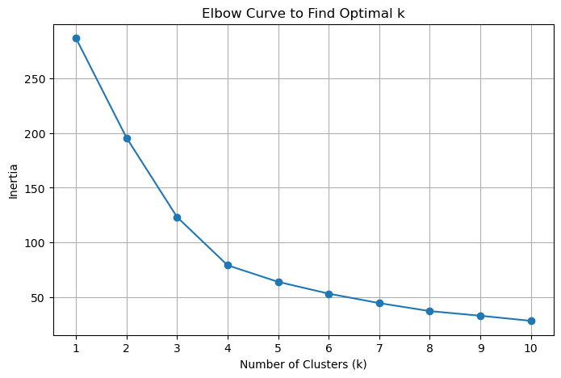
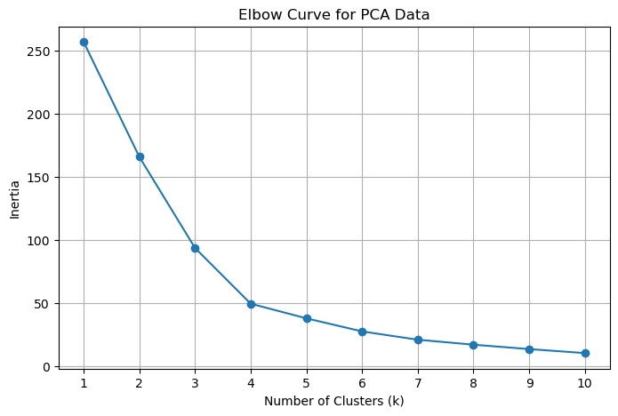
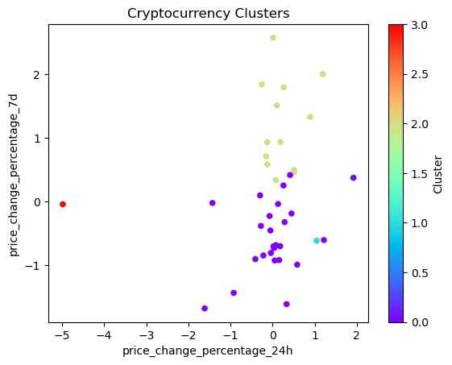
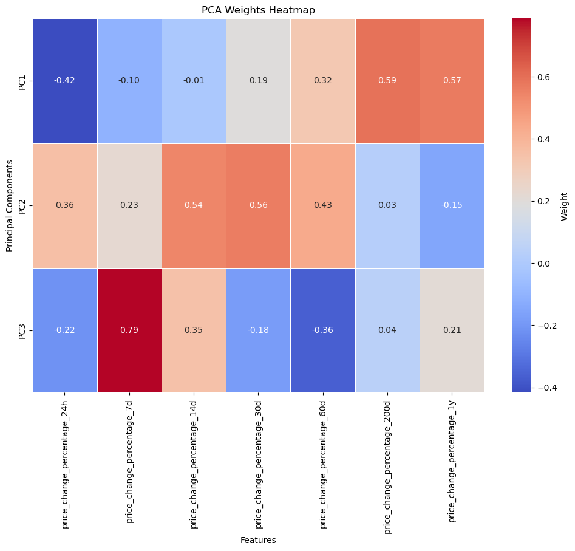

<div align="center">

<h1 style="font-size: 3em;">CryptoClustering</h1>  
<h2 style="font-size: 2em;">Classifying Cryptocurrencies Based on Price Fluctuations</h2>

</div>

This project leverages **K-Means clustering** and **Principal Component Analysis (PCA)** to classify cryptocurrencies based on their price percentage changes across various timeframes. By reducing data dimensionality and identifying patterns, the project enables a deeper understanding of cryptocurrency behavior and grouping.


---

## Table of Contents
- [User Story](#user-story)
- [Project Overview](#project-overview)
- [Goals](#goals)
- [Data Sources](#data-sources)
- [Installation](#installation)
- [Usage](#usage)
- [Methodology](#methodology)
- [Visualizations](#visualizations)
- [Insights](#insights)
- [Future Opportunities](#future-opportunities)
- [License](#license)

---

## User Story

Meet **Sophia**, a cryptocurrency enthusiast looking to diversify her portfolio. Sophia is curious about how cryptocurrencies cluster together based on their price volatility over time and whether such clusters can inform her investment strategy. 

Our goal is to help Sophia analyze and classify cryptocurrencies based on their price movements using machine learning. By clustering cryptocurrencies into distinct groups, Sophia can gain valuable insights into market behavior, ultimately guiding her portfolio decisions.

---

## Project Overview

This project explores patterns in cryptocurrency price changes over multiple timeframes, from daily to yearly, using the following approach:
1. **K-Means Clustering**: Categorize cryptocurrencies into clusters based on price change metrics.
2. **Principal Component Analysis (PCA)**: Reduce dataset dimensionality to focus on essential features and visualize cluster separations.
3. **Elbow Method**: Determine the optimal number of clusters for effective classification.

By combining these techniques, we classify cryptocurrencies into meaningful groups that highlight similarities and differences in market behavior, empowering investors like Sophia to make data-driven decisions.

---

### Goals

1. **Cluster Cryptocurrencies**: Group cryptocurrencies based on price volatility using the K-Means algorithm.
2. **Dimensionality Reduction**: Apply PCA to reduce data complexity and retain the most critical features.
3. **Determine Optimal Clusters**: Use the Elbow Method to find the best value for `k`.
4. **Visualize Patterns**: Create clear visualizations to analyze and interpret the clusters effectively.

---

## Data Sources

The data includes price percentage changes for various cryptocurrencies across different timeframes:
- **24-Hour Price Change Percentage** (`price_change_percentage_24h`)
- **7-Day Price Change Percentage** (`price_change_percentage_7d`)
- **30-Day Price Change Percentage** (`price_change_percentage_30d`)
- **60-Day Price Change Percentage** (`price_change_percentage_60d`)
- **200-Day Price Change Percentage** (`price_change_percentage_200d`)
- **1-Year Price Change Percentage** (`price_change_percentage_1y`)

---

## Installation

1. **Clone the Repository**
   ```bash
   git clone https://github.com/jsaintfleur/CryptoClustering.git
   cd CryptoClustering

2. **Install Dependencies**
Ensure all required packages are installed. You can install them using:

```bash
!pip install pandas scikit-learn matplotlib hvplot seaborn

```

3. **Dependencies**
Below is the core set of dependencies used in this project:
```python
import pandas as pd
from sklearn.cluster import KMeans
from sklearn.decomposition import PCA
from sklearn.preprocessing import StandardScaler
import matplotlib.pyplot as plt
import hvplot.pandas
import seaborn as sns

```

4. **Run the Project**
Open the Jupyter Notebook and execute the analysis:

``` bash
jupyter notebook CryptoClustering.ipynb
```


--- 

## Usage

### Run the Notebook
Open and run the `CryptoClustering.ipynb` notebook, which contains all code for preprocessing, clustering, and visualization.


### Data Analysis and Clustering

1. **Preprocess Data:** Standardize the data using StandardScaler to ensure consistent scaling.
2. **Find Optimal Clusters:** Use the Elbow Method to determine the optimal value for k.
3. **Apply PCA:** Reduce the dimensionality of the dataset for more manageable visualization and analysis.
4. **Cluster and Visualize:** Use K-Means to create clusters and analyze results through scatter plots and heatmaps.

---

## Methodology

1. **Data Preprocessing**
- Standardized price change percentages using StandardScaler to ensure all features have a mean of 0 and standard deviation of 1.
2. **Finding Optimal Clusters**
- Applied the Elbow Method on both raw and PCA-reduced data to identify the optimal number of clusters (k).
- Analyzed inertia values to locate the "elbow" point, indicating diminishing returns for increasing k.
3. **Principal Component Analysis**
- Reduced the dataset to three principal components while retaining the majority of variance.
- Visualized PCA results to understand feature contributions and clustering separations.
4. **K-Means Clustering**
- Grouped cryptocurrencies into clusters using K-Means for both raw and PCA-reduced data.
- Visualized clustering results through scatter plots and PCA component weights heatmaps.

---

## Visualizations

### 1. Optimal Clustering (Original Data)


### 2. Optimal Clustering (PCA Data)


### 3. Cryptocurrency Clusters


### 4. PCA Feature Influence


---

---

## Insights

### Optimal Clusters
- **Original Data**: Best k = 2.
- **PCA Data**: Best k = 3.

### Cluster Characteristics
- **PCA Clusters**: Reveal more nuanced groupings, highlighting the significance of long-term and mid-term price changes.

### Feature Influence
- **PC1**: Positively influenced by 1-year price changes and negatively by 24-hour changes.
- **PC2**: Driven by mid-term metrics (e.g., 30-day, 14-day changes).
- **PC3**: Dominated by weekly changes.

---

## Future Opportunities

### Dynamic Data Integration
- Incorporate real-time cryptocurrency data for continuous clustering updates.

### Expanded Feature Set
- Include additional metrics like trading volume, market capitalization, and social sentiment analysis.

### Predictive Modeling
- Combine clustering insights with time series forecasting for predicting future price movements.

### Interactive Dashboards
- Develop user-friendly dashboards to visualize clustering results and trends dynamically.

---

## License
This project is licensed under the MIT License. See the [LICENSE](LICENSE) file for details.

[Back to Top](#table-of-contents)
