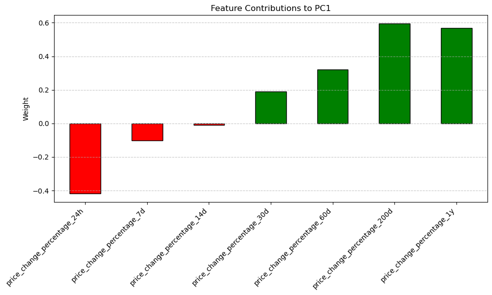
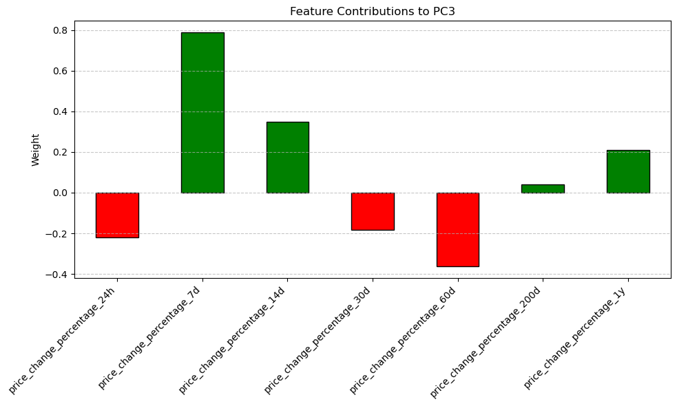

<div align="center">

<h1 style="font-size: 3em;">CryptoClustering</h1>  
<h2 style="font-size: 2em;">Classifying Cryptocurrencies Based on Price Fluctuations</h2>

</div>

This project leverages **K-Means clustering** and **Principal Component Analysis (PCA)** to classify cryptocurrencies based on their price percentage changes across various timeframes. By reducing data dimensionality and identifying patterns, the project enables a deeper understanding of cryptocurrency behavior and grouping.


---

## Table of Contents
- [User Story](#user-story)
- [Project Overview](#project-overview)
- [Goals](#goals)
- [Data Sources](#data-sources)
- [Installation](#installation)
- [Usage](#usage)
- [Methodology](#methodology)
- [Visualizations](#visualizations)
- [Insights](#insights)
- [Future Opportunities](#future-opportunities)
- [License](#license)

---

## User Story

Meet **Sophia**, a cryptocurrency enthusiast looking to diversify her portfolio. Sophia is curious about how cryptocurrencies cluster together based on their price volatility over time and whether such clusters can inform her investment strategy. 

Our goal is to help Sophia analyze and classify cryptocurrencies based on their price movements using machine learning. By clustering cryptocurrencies into distinct groups, Sophia can gain valuable insights into market behavior, ultimately guiding her portfolio decisions.

---

## Project Overview

This project explores patterns in cryptocurrency price changes over multiple timeframes, from daily to yearly, using the following approach:
1. **K-Means Clustering**: Categorize cryptocurrencies into clusters based on price change metrics.
2. **Principal Component Analysis (PCA)**: Reduce dataset dimensionality to focus on essential features and visualize cluster separations.
3. **Elbow Method**: Determine the optimal number of clusters for effective classification.

By combining these techniques, we classify cryptocurrencies into meaningful groups that highlight similarities and differences in market behavior, empowering investors like Sophia to make data-driven decisions.

---

### Goals

1. **Cluster Cryptocurrencies**: Group cryptocurrencies based on price volatility using the K-Means algorithm.
2. **Dimensionality Reduction**: Apply PCA to reduce data complexity and retain the most critical features.
3. **Determine Optimal Clusters**: Use the Elbow Method to find the best value for `k`.
4. **Visualize Patterns**: Create clear visualizations to analyze and interpret the clusters effectively.

---

## Data Sources

The data includes price percentage changes for various cryptocurrencies across different timeframes:
- **24-Hour Price Change Percentage** (`price_change_percentage_24h`)
- **7-Day Price Change Percentage** (`price_change_percentage_7d`)
- **14-Day Price Change Percentage** (`price_change_percentage_14d`)
- **30-Day Price Change Percentage** (`price_change_percentage_30d`)
- **60-Day Price Change Percentage** (`price_change_percentage_60d`)
- **200-Day Price Change Percentage** (`price_change_percentage_200d`)
- **1-Year Price Change Percentage** (`price_change_percentage_1y`)

---

## Installation

1. **Clone the Repository**
   ```bash
   git clone https://github.com/jsaintfleur/CryptoClustering.git
   cd CryptoClustering


2. **Install Dependencies**
Ensure all required packages are installed. You can install them using:

```bash
!pip install pandas scikit-learn matplotlib hvplot seaborn

```

3. **Dependencies**
Below is the core set of dependencies used in this project:
```python
import pandas as pd
from sklearn.cluster import KMeans
from sklearn.decomposition import PCA
from sklearn.preprocessing import StandardScaler
import matplotlib.pyplot as plt
import hvplot.pandas
import seaborn as sns

```

4. **Run the Project**
Open the Jupyter Notebook and execute the analysis:

``` bash
jupyter notebook CryptoClustering.ipynb
```


--- 

## Usage

### Run the Notebook
Open and run the `CryptoClustering.ipynb` notebook, which contains all code for preprocessing, clustering, and visualization.


### Data Analysis and Clustering

1. **Preprocess Data:** Standardize the data using StandardScaler to ensure consistent scaling.
2. **Find Optimal Clusters:** Use the Elbow Method to determine the optimal value for k.
3. **Apply PCA:** Reduce the dimensionality of the dataset for more manageable visualization and analysis.
4. **Cluster and Visualize:** Use K-Means to create clusters and analyze results through scatter plots and heatmaps.

---

## Methodology

1. **Data Preprocessing**
- Standardized price change percentages using StandardScaler to ensure all features have a mean of 0 and standard deviation of 1.
2. **Finding Optimal Clusters**
- Applied the Elbow Method on both raw and PCA-reduced data to identify the optimal number of clusters (k).
- Analyzed inertia values to locate the "elbow" point, indicating diminishing returns for increasing k.
3. **Principal Component Analysis**
- Reduced the dataset to three principal components while retaining the majority of variance.
- Visualized PCA results to understand feature contributions and clustering separations.
4. **K-Means Clustering**
- Grouped cryptocurrencies into clusters using K-Means for both raw and PCA-reduced data.
- Visualized clustering results through scatter plots and PCA component weights heatmaps.

---

## Visualizations

This section presents key visualizations generated during the clustering and PCA processes. Each figure is accompanied by a description and observations.

---

### 1. Elbow Curve for PCA Data


**Description:**  
This plot shows how the inertia decreases as the number of clusters (`k`) increases. The "elbow point" represents the optimal number of clusters where adding more clusters provides diminishing returns in reducing inertia.  

**Observation:**  
For the PCA-reduced data, the optimal number of clusters is **4**, as indicated by the elbow at \(k = 4\).

---

### 2. Feature Contributions to Principal Components (PCA)

#### Heatmap of Feature Contributions


**Description:**  
This heatmap visualizes how each feature contributes to the three principal components (PC1, PC2, and PC3). Positive contributions are shown in green, while negative contributions are shown in red.  

**Observation:**  
- **PC1**: Long-term metrics like 1-year and 200-day price changes have the highest positive contributions.  
- **PC2**: Mid-term metrics like 30-day and 14-day price changes dominate.  
- **PC3**: Short-term volatility (7-day changes) has the strongest positive influence, while the 60-day change negatively influences this component.

---

#### Bar Plots for Individual Principal Components

- **PC1 Contributions**
  

  **Observation:**  
  - The 1-year and 200-day price changes significantly contribute to PC1.  
  - Short-term changes (e.g., 24-hour change) negatively influence this component.

  ---

- **PC2 Contributions**
  

  **Observation:**  
  - PC2 is dominated by mid-term metrics like 30-day and 14-day changes.  
  - Long-term metrics (e.g., 200-day change) have a small negative influence.

  ---

- **PC3 Contributions**
  

  **Observation:**  
  - The 7-day price change strongly influences PC3.  
  - The 60-day change negatively contributes to this component.

---

### 3. Cryptocurrency Clusters

#### Scatter Plot: PCA Components (PC1 vs. PC2)


**Description:**  
This scatter plot visualizes the cryptocurrency clusters based on the first two principal components (PC1 and PC2). Each color represents a unique cluster identified by the K-Means algorithm.

**Observation:**  
- The clusters are well-separated in the PCA-reduced space.  
- Cryptocurrencies within the same cluster exhibit similar long-term and mid-term price patterns.

---

#### Scatter Plot: Raw Data (24-Hour vs. 7-Day Changes)


**Description:**  
This scatter plot visualizes clusters based on raw data, specifically the 24-hour and 7-day price changes. Colors represent different clusters.

**Observation:**  
- The clusters are influenced by short-term volatility.  
- Cryptocurrencies with extreme 24-hour or 7-day changes often form distinct clusters.

---

### Summary of Visualizations

1. **Elbow Curve**: Identifies optimal clusters for both PCA-reduced and raw data.
2. **Feature Contributions**: Highlights the influence of different price change timeframes on each principal component.
3. **Cluster Visualizations**: Scatter plots showcase cluster separations in PCA space and raw feature space, emphasizing how cryptocurrencies with similar price behaviors are grouped.

These visualizations provide insights into cryptocurrency market behavior and enable more informed investment decisions.

---

## Insights

### Optimal Clusters
- **Original Data**: Best \( k = 4 \). Clusters reflect short-term and long-term price changes, with well-defined separations between groups.
- **PCA Data**: Best \( k = 4 \). Clusters emphasize broader trends, reducing noise and focusing on meaningful patterns derived from the principal components.

### Cluster Characteristics
- **Original Clusters**: Highlight variations across short-term (e.g., 24-hour, 7-day changes) and long-term trends. Cryptocurrencies with high short-term volatility form distinct clusters.
- **PCA Clusters**: Capture nuanced groupings by combining the influence of long-term and mid-term price metrics, offering a more holistic view of market behavior.

### Feature Influence
- **PC1**: Strongly influenced by long-term metrics like 1-year and 200-day price changes (positive), while 24-hour changes negatively affect it.
- **PC2**: Dominated by mid-term metrics such as 30-day and 14-day price changes, highlighting intermediate trends.
- **PC3**: Short-term volatility is the main driver, with the 7-day price change being the strongest positive contributor and the 60-day change contributing negatively.

---

## Future Opportunities

### Dynamic Data Integration
- Incorporate live cryptocurrency data streams to enable real-time cluster updates and analysis.

### Expanded Feature Set
- Integrate additional metrics such as:
  - **Market Sentiment**: Analyze social media and news to gauge investor sentiment.
  - **Trading Volume**: Understand liquidity trends within clusters.
  - **Market Cap**: Group cryptocurrencies by relative size and influence.

### Predictive Modeling
- Utilize cluster insights to develop predictive models for:
  - Future price movements.
  - Volatility patterns within specific clusters.

### Interactive Dashboards
- Build dynamic, user-friendly dashboards that allow users to:
  - Visualize cluster compositions and trends.
  - Explore feature contributions to each cluster.
  - Monitor changes in real-time as new data is integrated.

---

### Key Adjustments:
1. Confirmed the optimal \( k \) values: 4 for raw data and 4 for PCA-reduced data.
2. Verified feature influences based on PCA weights.
3. Aligned observations with the clustering visualizations and analysis outcomes.

---

## License
This project is licensed under the MIT License. See the [LICENSE](LICENSE) file for details.

[Back to Top](#table-of-contents)
